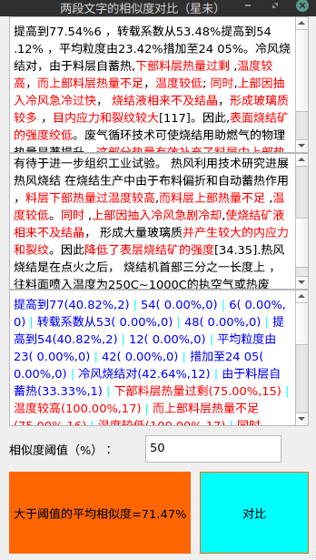

# 两段文字相似度对比程序（带界面,可用于论文降重）

## （1）使用Python及其simtext包，逐句计算两段文本相似度
（一段自己的，一段别人的），
并实现相似度大于阈值的文字标红。
##  (2) 使用PyQt5，实现界面
## （3）实现相似度大于阈值的句子标红
## （3）使用pyinstaller打包成exe

## 达到的效果（GUI）：

## 打包好的下载链接：
论文降重小工具下载全部链接（免费免安装，两段文字相似度对比） - 星未的文章 - 知乎
https://zhuanlan.zhihu.com/p/378432331

## 代码中有从网络上参考或者直接复制过来的内容，对原作者致以谢意！
## 但因时间有些久了，来源无法一一追溯，故没有列出来源。报以歉意！
## 本人为编程爱好者，以实现功能为目标，所以代码写的天马行空。欢迎交流、批评和指正！
